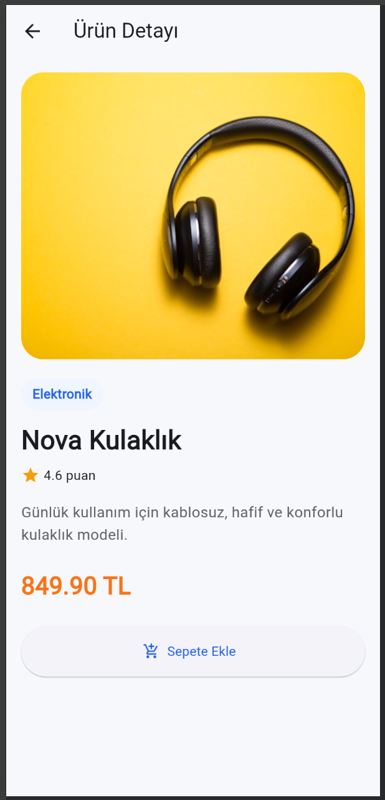

# Mini Katalog Uygulaması

Bu proje Flutter eğitimi kapsamında hazırlanmış basit bir mobil katalog uygulamasıdır. Uygulamada ürünler grid yapısında listelenir, ürün detay sayfasına geçiş yapılır ve sepete ekleme işlemi basit state güncellemesiyle simüle edilir.

## Kullanılan Teknolojiler

- Flutter SDK
- Dart SDK
- material.dart
- Visual Studio Code
- Android Emulator veya fiziksel Android cihaz

Ekstra paket kullanılmamıştır. Proje temel Flutter yapılarıyla hazırlanmıştır.

## Proje Özellikleri

- Ana sayfa ve ürün listeleme ekranı
- GridView ile ürün kartları
- Ürün detay sayfası
- Navigator.push ile sayfa geçişi
- Route üzerinden ürün nesnesi taşıma
- JSON simülasyonu ve Product model sınıfı
- fromJson / toJson örneği
- Basit arama ve kategori filtreleme
- Sepete ekleme butonu ile state güncelleme
- Düzenli klasör yapısı

## Klasör Yapısı

```text
lib/
  data/
    product_data.dart
  models/
    product.dart
  screens/
    home_screen.dart
    product_detail_screen.dart
  widgets/
    banner_card.dart
    product_card.dart
  main.dart
```

## Çalıştırma Adımları

Projeyi çalıştırmak için Flutter kurulu olmalıdır. Terminalde proje klasörüne girip aşağıdaki komutlar çalıştırılır:

```bash
flutter pub get
flutter run
```

Emulator açık değilse önce Android Studio üzerinden bir emulator başlatılabilir ya da fiziksel Android cihaz kullanılabilir.

## Flutter Sürümü

Proje Flutter 3.x ve Dart 3.x sürümleriyle çalışacak şekilde hazırlanmıştır.

## Ekran Görüntüleri

Ana sayfa ve detay ekranına ait örnek görseller `screenshots` klasöründe yer almaktadır.




## GitHub

https://github.com/esmauuid/flutterminikatalog.git
